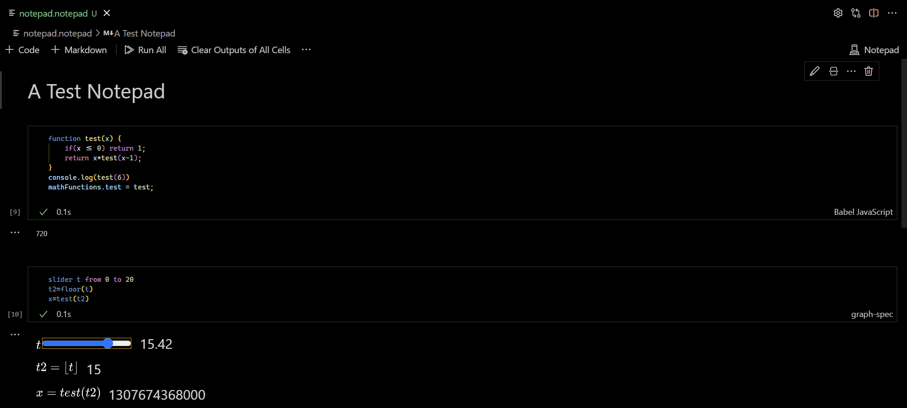

# Notepad Notebook

This is a work in progress extension to use vscode to take notes in a multimedia format.
It uses vs code's custom notbook capabilities.

Using this you can display:

* Well formated text using markdown
* Images using markdown
* Javascript code and it's output
* Interactive well displayed math

You can also use `mathFunctions` to define js functions that you can use in the math.
